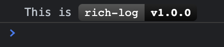
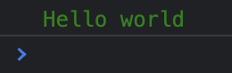
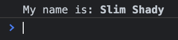
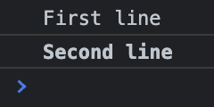
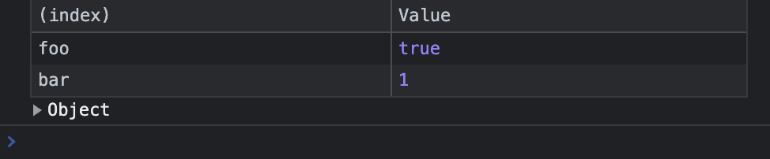
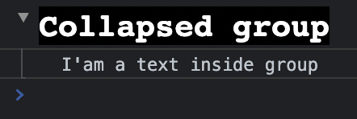
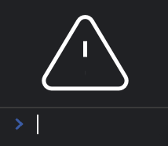

# Rich Log

<center>
React plugin for writing styled console logs using JSX.
</center>

## Get started

```bash
yarn add rich-log
```

```tsx
import RichLog from 'rich-log';

RichLog.log(
  <RichLog.Fragment>
    <RichLog.Text>This is </RichLog.Text>
    <RichLog.Text
      color="white"
      background="linear-gradient(#555, #333)"
      padding="2px 6px"
      borderRadius="4px 0 0 4px"
      fontFamily="monospace"
    >
      rich-log
    </RichLog.Text>
    <RichLog.Text
      color="white"
      background="linear-gradient(#222, #090909)"
      padding="2px 6px"
      borderRadius="0 4px 4px 0"
      fontWeight="bold"
      fontFamily="monospace"
    >
      v1.0.0
    </RichLog.Text>
  </RichLog.Fragment>,
);
```

Output:



Thats it!

## Benefits ✨

- JSX in `console.log`
- Styling with props (like styled-component)
- Lightweight
- Written in Typescript
- Works with React and Preact

## Components

### `<RichLog.Text />`

A component for displaying styled text.

```tsx
RichLog.log(
  <RichLog.Text fontSize="12px" color="green">
    Hello world
  </RichLog.Text>,
);
```

Output:



### `<RichLog.Fragment />`

If you want to display several components at once, you can nest them in a fragment.

```tsx
RichLog.log(
  <RichLog.Fragment>
    <RichLog.Text>My name is: </RichLog.Text>
    <RichLog.Text fontWeight="bold">Slim Shady</RichLog.Text>
  </RichLog.Fragment>,
);
```

Output:



If you want to separate text lines, you use the `separate`-prop:

```tsx
RichLog.log(
  <RichLog.Fragment>
    <RichLog.Text separate>First line</RichLog.Text>
    <RichLog.Text fontWeight="bold">Second line</RichLog.Text>
  </RichLog.Fragment>,
);
```

Output:



### `<RichLog.Table />`

Component for rendering data to table.

```tsx
RichLog.log(<RichLog.Table data={{ foo: true, bar: 1 }} />);
```

Output:



### `<RichLog.Group />`

Component for grouping logs.

```tsx
RichLog.log(
  <RichLog.Group
    header={
      <RichLog.Text fontSize="20px" fontFamily="monospace" background="black" color="white">
        Collapsed group
      </RichLog.Text>
    }
  >
    <RichLog.Text>I'am a text inside group</RichLog.Text>
  </RichLog.Group>,
);
```

Output:



### `<RichLog.SVG />`

Component for rendering svg icons.

```tsx
RichLog.log(
  <RichLog.SVG
    height="60px"
    width="60px"
    value='<svg
      xmlns="http://www.w3.org/2000/svg"
      xmlns:xlink="http://www.w3.org/1999/xlink"
      viewBox="0 0 24 24"
      width="24"
      height="24"
      stroke="white"
      strokeWidth="2"
      fill="none"
      strokeLinecap="round"
      strokeLinejoin="round"
    >
      <path d="M10.29 3.86L1.82 18a2 2 0 0 0 1.71 3h16.94a2 2 0 0 0 1.71-3L13.71 3.86a2 2 0 0 0-3.42 0z"></path>
      <line x1="12" y1="9" x2="12" y2="13"></line>
      <line x1="12" y1="17" x2="12.01" y2="17"></line>
    </svg>'
  />,
);
```

Output:



## TODO

- [ ] Images
- [ ] Safari support
- [ ] Styled tables
- [ ] JSX `<svg />`

## License

`rich-log` is [WTFPL licensed](./LICENSE).
